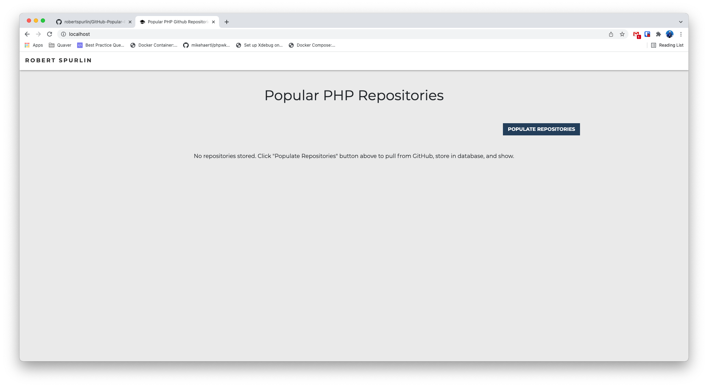
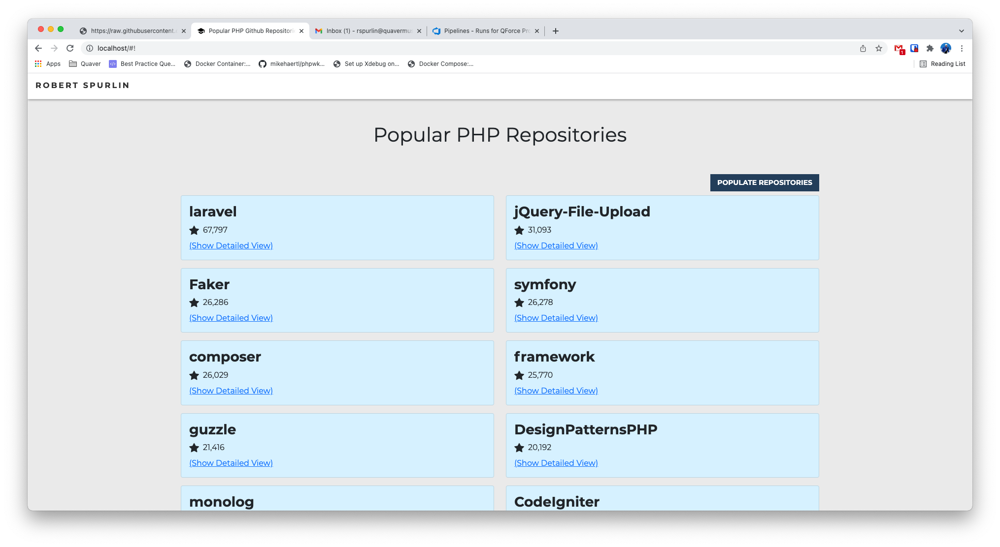

## Popular PHP GitHub Repositories

Hello, friends, and thanks again for your consideration of me for this position.

This is a Laravel application, built with the most recent version of Laravel (at this writing), PHP 8.1, and Vue 2.6 / Bootstrap 5 for the front end. This application was built using Docker containers (one for the DB, and one for the application), using Laravel Sail as a base starting point to build these containers.


## Installation

First, ensure that you either have Docker and Docker Compose or Docker Desktop (it comes with both) on your computer. I used Docker Desktop on an Intel Chip Mac. https://www.docker.com/products/docker-desktop

Then, clone this repository into a directory of choice.

Within the directory that you've cloned the repository in, spin up a helper Docker container that will install all of our Composer dependencies (including Laravel Sail), and then remove itself. The command to do such a thing (using PHP 8.1) is below:

```
docker run --rm \
    -u "$(id -u):$(id -g)" \
    -v $(pwd):/var/www/html \
    -w /var/www/html \
    laravelsail/php81-composer:latest \
    composer install --ignore-platform-reqs
```

After the helper Docker container is complete installing everything, starting both containers for the application should be as easy as running this command in the directory:

```
./vendor/bin/sail up -d
```

The command above will create the two Docker containers and start them. It might take a minute or two, as it has to create the images needed for the containers on the first run. But after that, starting up both containers should take very little time.

You should now be able to connect to the DB using your MySQL client of choice (host: 127.0.0.1, port: 3306, username: sail, password: password) and see that there is an empty schema already created called github_popular_php_repositories.

You can pass the Laravel Docker container commands using Sail. This method can be used for anything with Composer, Node, and any Artisan commands. You can test this (to show a list of the available Artisan commands) using:

```
./vendor/bin/sail artisan list
```

We will utilize one of these commands to run a Migration that will create the repositories table (this migration is defined in /app/database/migrations/2021_12_21_000000_create_repositories_table.php). The command to run all Migrations is:

```
./vendor/bin/sail artisan migrate
```

The migration will create three new tables in the DB, including the one we care most about - repositories.

Finally, let's install Node, it's dependencies, and compile everything needed for the front end. I have committed all of the compiled assets just in case, but they will be overwritten with the compile and that's OK.

```
./vendor/bin/sail npm install
```

```
./vendor/bin/sail npm run dev
```

You are now free to hit http://localhost in your browser of choice.


## Usage



After hitting http://localhost, you should be greeted with a page titled "Popular PHP Repositories", a button labled "Populate Repositories", and a message saying:

```
No repositories stored. 'Click "Populate Repositories" button above to pull from GitHub, store in database, and show.
```

Click the "Populate Repositories" button, and an AJAX call will be made to:
1. Truncate the repositories table,
2. retrieve the 100 most starred PHP repositories via the GitHub API (search terms: "php language:php is:public", filters: sort=stars, per_page=100), 
3. and store them in the repositories database. 

All fields requested (ID, Name, URL, created date, last push date, description, and number of stars) are grabbed from the response and stored. 

Then, another AJAX request will be made to retrieve the repositories from the database (sorted by number of stars) to populate the page.



The repositories are paginated to 10 per page, and the pagination is below the repositories. You are also able to click through and see all information stored for each repository via the "Show Detailed View" link.

If you spam the "Populate Repositories" button (to the tune of 10/minute), you will recieve a Toast notification on the top right side of the page denoting that the GitHub API limit has been reached.


## Testing

Tests have been made to ensure that the application is working as intended - they are defined in /tests. To run the tests, run this command in the app directory:

```
./vendor/bin/sail test
```

You should recieve output denoting that the tests have been ran and that they passed.


## Notes

- I would never commit the .env, but it is necessary here to make Sail spin up the schema and user properly. Also, it ensures that it will always connect to the DB container in the correct manner.

- I recognize that there are some holes in my testing, namely the Exception catches when the GitHub API responds with Too Many Requests. I chose not to automate that part of my testing because I want to ensure that if testing was done before the initial load of the page, there would still be enough requests left to populate the list. I also could've tested more of the front end experience (such as ensuring that the lists show up after a simulated click of the button), but thought that the API testing has enough overlap to ensure that all things are working.